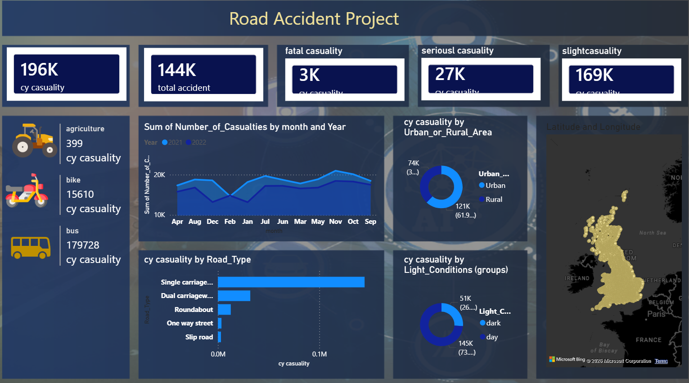

# Road Accident Analysis Dashboard 🚗

Power BI dashboard analyzing 144K road accidents with 196K casualties.

### **Key Insights:**
- **Total Accidents**: 144K | **Casualties**: 196K
- **Fatal**: 3K | **Serious**: 27K | **Slight**: 169K
- **Highest casualties**: Single carriageway roads
- **Urban vs Rural**: 121K Rural vs 74K Urban casualties
- **By Vehicle**: Bus 17.9K, Bike 15.6K, Agriculture 399

### **Dashboard Preview:**

### **Tools Used:**
Power BI, Data Visualization, Data Analysis

### **Dataset:**
UK Road Accident Data 2021-2022

### **File:**
Download `Road Accident Project.pbix` to view interactive dashboard
